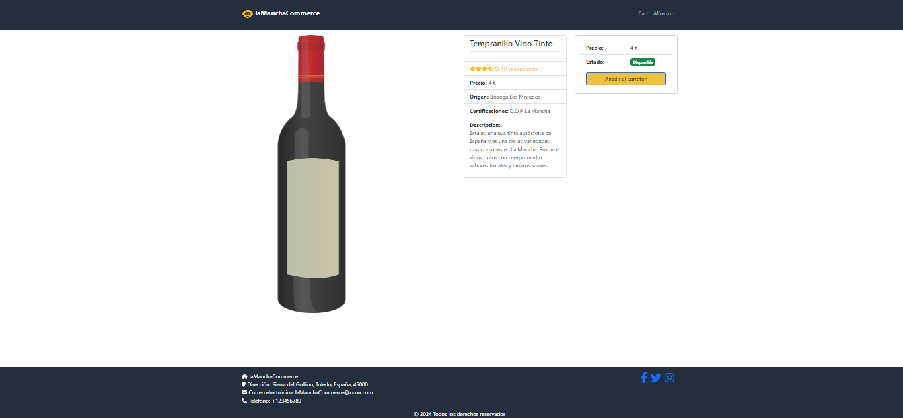

# 🛍️ Proyecto laManchaCommerce

Bienvenido al proyecto de eCommerce desarrollado con la pila MERN (MongoDB, Express, React y Node.js). Este proyecto proporciona una plataforma de comercio electrónico con características esenciales como gestión de productos, usuarios, carritos de compra y órdenes.

## ✨ Características

- 🔐 **Autenticación y autorización de usuarios** (registro, inicio de sesión, roles de usuario y administrador).
- 🛒 **Gestión de productos** (añadir, editar, eliminar).
- 🗂️ **Gestión de categorías**.
- 🛍️ **Carrito de compras**.
- 💳 **Procesamiento de pagos**.
- 📜 **Historial de órdenes**.
- ⭐ **Opiniones y valoraciones de productos**.
- 🔍 **Búsqueda y filtrado de productos**.

## 🛠️ Tecnologías Utilizadas

- **Frontend**: React, Redux, Axios, React Router, Bootstrap
- **Backend**: Node.js, Express
- **Base de Datos**: MongoDB, Mongoose
- **Autenticación**: JSON Web Tokens (JWT)
- **Despliegue**: Render.com, MongoDB Atlas

## ⚙️ Requisitos

- [Node.js](https://nodejs.org/)
- [MongoDB](https://www.mongodb.com/)

## 🚀 Instalación

1. Clona el repositorio:
   ```bash
   git clone https://github.com/acreft/eCommerceTfg.git
   ```
2. Navega al directorio del proyecto:
   ```bash
   cd tu_repositorio
   ```
3. Instala las dependencias del backend:
   ```bash
   cd backend
   npm install
   ```
4. Instala las dependencias del frontend:
   ```bash
   cd ../frontend
   npm install
   ```
5. Crea un archivo `.env` en el directorio `backend` con las siguientes variables:
   ```env
   NODE_ENV=development
   PORT=5000
   MONGO_URI=tu_mongodb_uri
   JWT_SECRET=tu_secreto_jwt
   ```
6. Ejecuta el servidor backend:
   ```bash
   cd backend
   npm start
   ```
7. Ejecuta el servidor frontend:
   ```bash
   cd ../frontend
   npm start
   ```

## 📋 Uso

1. Regístrate como un nuevo usuario o inicia sesión con una cuenta existente.
2. Explora los productos disponibles, añade productos al carrito y realiza compras.
3. Como administrador, gestiona los productos, categorías y órdenes.

## Entornos

Estos son los entornos que se disponen para este eCommerce:

- INT: https://lamanchacommerce-int.onrender.com/
- PRO: https://ecommercetfg-pro.onrender.com/

Render.com apaga o pone en un estado de hibernación las aplicaciones que no han tenido tráfico durante un tiempo determinado.Cuando un usuario accede después de un tiempo de inactividad, la aplicación necesita "despertarse", lo que causa un retraso en la carga de unos 40 seg. Esto es debido a la versión gratuita de Render.com.

## 📸 Capturas de Pantalla



## 🤝 Contribución

¡Las contribuciones son bienvenidas! Si deseas contribuir a este proyecto, sigue estos pasos:

1. Haz un fork del proyecto.
2. Crea una rama con tu nueva característica (`git checkout -b feature/nueva-caracteristica`).
3. Realiza tus cambios y haz commit (`git commit -m 'Añadir nueva característica'`).
4. Envía tus cambios a tu fork (`git push origin feature/nueva-caracteristica`).
5. Abre un Pull Request.

## 📧 Contacto

Para cualquier pregunta o comentario, por favor, contacta a [tu_email@ejemplo.com](mailto:tu_email@ejemplo.com).

---

¡Gracias por visitar nuestro proyecto! 🎉
